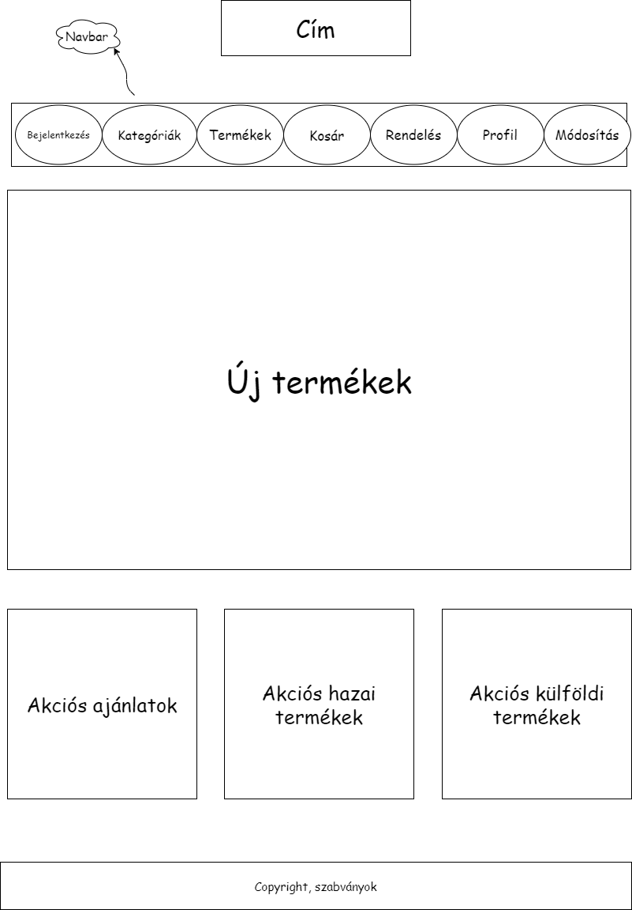

# 1. Jelenlegi helyzet

Csapatunk elkötelezett az alkoholos italok fogyasztásának elősegítésében, illetve értékesítésében, ezért is tűztük ki célul, hogy vásárlóink
az otthonuk melegéből választhassák ki kedvenc szeszesitaljukat kedvező áron, és a barátaikkal és/vagy családtagjaikkal együtt osztozzanak kedvenc pillanataikon.

# 2. Terjedelem

A projekt célja az, hogy egy teljeskörűen működő italkereskedő weboldalt készítsünk, ahol nem csak az országban fellelhető alkoholmentes és alkoholos italok közül választhatnak vásárlóink,
hanem exkluzív, csak más ország(ok)ban kapható italok népszerűvé tételében is segítsünk.

# 3. Követelmény lista
| Modul | ID | Megnevezés | Leírás |
|--------|---------|-----------|----------------------------------|
|Adatbázis|D1|Megnevezés|Az adatbázis a következőket tartalmazza: táblák, relációk|
|Azonosítás|A1|Regisztráció|A felhasználó új fiókot tud regisztrálni az oldalra|
|Azonosítás|A2|Bejelentkezés|A felhasználó be tud jelentkezni az fiókjába|
|Azonosítás|A3|Kijelentkezés|A felhasználó ki tud jelentkezni a fiókjából|
|Azonosítás|A4|Elfelejtett jelszó|A felhasználó meg tudja változtatni a fiókjához tartozó jelszavát|
|Oldalak|P1|Főoldal|A felhasználó automatikusan a kezdőoldalra lesz átirányítva.|
|Oldalak|P2|Kategóriák|A felhasználó ki tudja választani, mit keres|
|Oldalak|P3|Termékek|A felhasználó láthatja a különböző termékek árát, leírását|
|Oldalak|P4|Kosár|Tartalmazza az összes olyan terméket, amit a vásárló kiválasztott. Az oldalon belül tudja a termékek számít csökkenti, illetve növelni|
|Oldalak|P5|Megrendelő oldal|A felhasználó meg tudja adni, hogy hova szeretne rendelni, illetve hogy kártyával vagy készpénzzel szeretne-e fizetni|
|Oldalak|P6|Profil|A felhasználó profiljának az adatait tartalmazza|
|Oldalak|P7|Profil adatainak módosítása|A felhasználó tudja szerkeszteni az adatait|

# 4. Szabványok és jogok
## Alapvető követelmények:
A weboldalnak a következő alapvető követelményeknek kell megfelelnie:

- Könnyen érthetőnek és használhatónak kell lennie.
- Logikus felépítsűnek kell lennie a felhasználók számára.
- Használja az ipar legjobban bevált folyamatait.
- Stílusok használata, ami átláthatóvá teszi az egyes oldalak részleteit, ezen belül:
    - Hibaüzenetek megjelenítése jól látható helyen és stílusban
    - Olyan panelek létrehozása, ami az alapvető felhasználók számára nem látható, kizárólag a weboldal üzemeltetői férnek hozzá.

## Kompatibilis böngészők:

- Google Chrome
- Mozilla Firefox
- Internet Explorer

## Adatkezelési nyilatkozat:
Az Adatkezelési ‌Nyilatkozat kialakítása során figyelembe vettük a vonatkozó hatályos jogszabályokat, illetve a fontosabb nemzetközi ajánlásokat. Ezekre tekintettel dr. Radics Ottó egyéni vállalkozó Adatkezelési Nyilatkozata megfelel az alábbi jogszabályoknak:

- Információs önrendelkezési jogról és az információszabadságról szóló 2011. évi CXII. törvény;
- Az elektronikus ‌hírközlésről szóló 2003. évi C. törvény;
- Az elektronikus kereskedelemről szóló 2001. évi CVIII. törvény előírásainak;
- Az "Online Privacy Alliance" ajánlásainak.

# 5. Jelenlegi üzleti folyamatok modellje
Több-kevesebb idő és vesződség mellett veszélyeket és buktatókat is rejthet a szeszesital és egyébb termékek árusítása. Hogyan adjunk fel megfelelő hírdetéseket róla ezen belül mi szerepeljen a hirdetésben és milyen hibákat ne kövessünk el.
Szeszesital árusítása során sosincs kifogyó kereslet, emellett még megfelelő árakkal pedig könnyen kilehet harcolni a magas igényt az italkereskedés után. Ezzel nem lesz gond, viszont nem árt a megfelelően kialakított kapcsolat a nagykereskedés és a saját italkereskedésünk között.

# 6. Igényelt üzleti folyamatok modellje
Italkereskedés esetén mégis mi nyújthat biztonságot? Az első szó, ami eszünkbe jut ennek kapcsán, az a vásárlók bizalmának elnyerése. Habár a felelősségvállalás terhét gondoljuk a szó mögé, szerencsére a jogalkotó részletesebben foglalkozik a kérdéssel. Ugyanis sok félreértés születne belőle, ha más-más tartalommal lehetne megtölteni a felelősség kérdését. Ez persze jó hír, hiszen a kárigényünket is könnyebben érvényesíthetjük a fogalmak tisztázása után. A jog szó helyett a jog a jótállást és a szavatosságot használja. Mégpedig nyomós okkal különíti el ezt a látszólag hasonló kérdéskört. A hatályos Polgári Törvénykönyv szerint, aki jótállást vállal vagy arra köteles egy termékkel kapcsolatban, felelnie kell a hibás teljesítésért, ami nem feltétlen jó hír az italkereskedés számára. 
# 7. Használati esetek
## Felhasználó:
- Tudnia kell regisztrálnia egy új fiókot
- Tudnia kell bejelentkeznie a fiókjába
- Tudnia kell kijelentkeznie a fiókjából
- Látnia kell a főoldalt
- Látnia kell a termékek különböző kategóriáit, illetve azok lista nézetét
- Tudnia kell szűrni különböző kategóriák között
- Tudnia kell megtekinteni egy terméket, annak árát és leírását
- Tudnia kell hozzáadni a kiválasztott termék(ek)et a kosárhoz
- Tudnia kell leadni a rendelését

## Adminisztrátor:
- Minden felhasználói jogosultsággal rendelkezik
- Tudnia kell új terméket hozzáadni a már meglévők mellé
- Tudnia kell a termék árát és leírását módosítani
- Tudnia kell törölni terméket
- Hozzáférése kell, hogy legyen és látnia az összes megrendelést a felhasználóktól

# 8. Képernyő tervek

